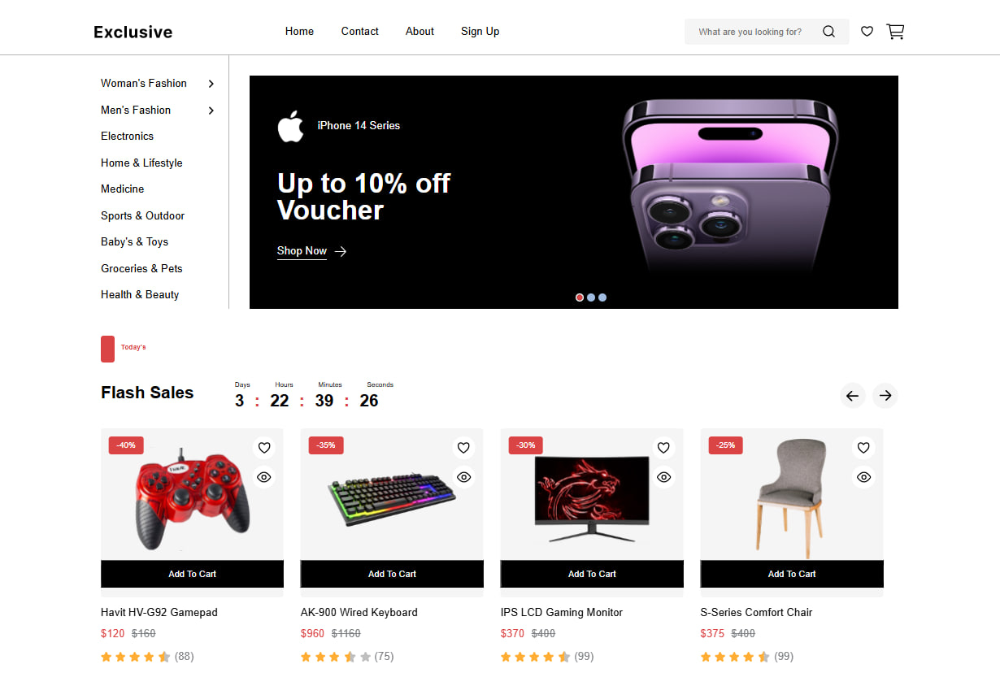

 E-Commerce Web App
A modern e-commerce website built with [React.js], featuring product browsing, cart functionality, user authentication, and integration with a mock backend.

🎨 Figma Design
[View Figma Design](https://www.figma.com/design/MAxEHkpsOZsPXdOvCYRWuW/Full-E-Commerce-Website-UI-UX-Design--Community-?node-id=1-3&p=f&t=npFunQzFGfJiYe2y-0)

🧰 Tech Stack

-Frontend: React, React Router, Context API

-Styling: Tailwind CSS / CSS Modules

-State Management: Context API / Redux

-Animations: Framer Motion

-Backend (Mock): JSON Server / MockAPI

-Design Tool: Figma

🚀 Features

-Product Search

-Wishlist / Likes

-Add to Cart with Quantity and color Selector

-User Authentication (Sign up / Login)

-Persist user state with localStorage

-Product Quick View Modal

